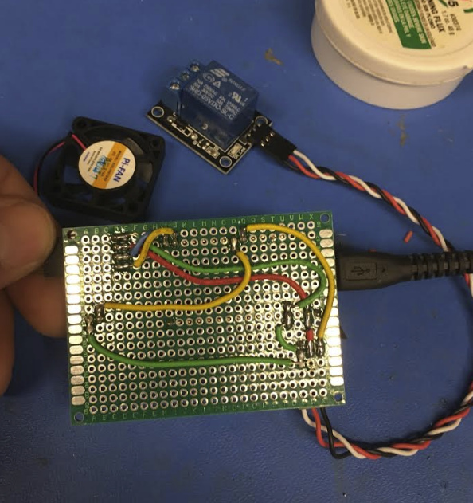
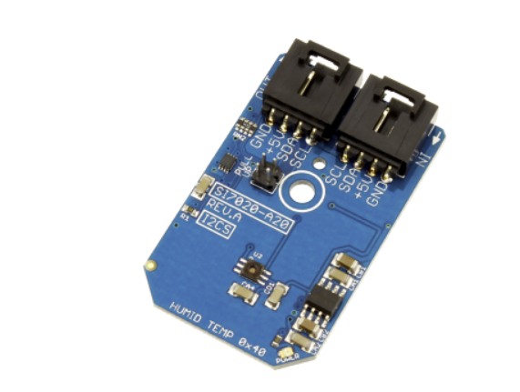
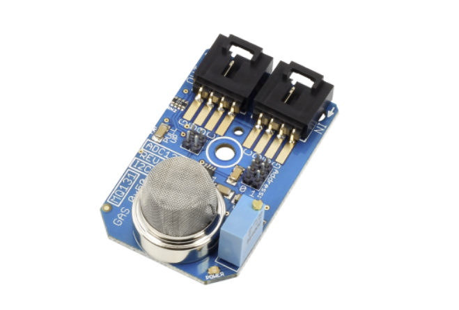

# Contents

This folder contains a functional prototype including hardware setup and code base for demo'ing purposes. 
Ubidots has been selected due to it's white label service and automatic creation of feeds when devices are connected. 

# About
This prototype is in the alpha stage of conceptualization, the idea is to have a light weight wireless module complete with OTA, Low Power and temp/ humidity feedback trigers. 

Two LED lights will be attached to pins for debugging.  The one of the lights will be for debugging purposes during OTA flashing.  One will be used to demonstrate triggers and wireless controls (i.e. phone apps or BLE)

# Method for scaling
Firmware will be written in two sections 1) Operation and 2) keys and configuration.
Python or golang will be used to create individual configuration files that will be unique for each device, by splitting the code into sections described above, I will be able to assign unique keys and feed variables specific for each device.

The other problem that will need to be solved is the method for connecting to the internet - wifimanager will be used to create an AP so that the end user can manually set wifi parameters without having to flash the device. (this is currently being developed).  

# Triggers

The triggers are represented by 1 output connected to a GPIO pin.  This will be used for toubleshooting, testing set points (feedback), and communication acknowlagement through third party IOS platforms.

A relay will also be used to test flexible set points and manual triggers from the consol. This relay will be wired up to a 120v lightbulb or fan for demonstrating purposes

# IOS platform(s)

Several IOS platforms are currently being explored, Ubidots, Thingspeak and adafruit.

Adafruit 

Pros 
- Ease of use
- interface
- library

cons
- restriction/ throttle on data
- limited analalytics

Thingspeak

pros
- Ease of use
- data analytics (matplot)
- IOS wiget

Cons 
- Visual appearence
- App 

Ubidots

Pros
- White label
- documentation
- API

Cons
- price
- configuration (user end) 

# MCu

The choice Mcu for this project is an adafruit feather ESP8266 Dev board, MRP is  15 - $20. Other cheeper versions were explored but this was the only one functioning properly for Over the air flashing- flash size requirements of the ESP8266 must be 4MB or larger (double check this).

This project aims to KSS (Keep it simple stupide), the setup proposed should have all the necessary components to test IOT integration and data integrity. (Not the most accurate temp humidity sensor, but good enough for testing critical functions in firmware developement.)

# Breakout

# Sensors
### Temp/Humidity (I2C)

#### Public Repository
https://github.com/ControlEverythingCommunity/SI7020-A20

### Gas Sensor (I2C)

#### Public Repository
https://github.com/ControlEverythingCommunity/ADC121C_MQ131

# Outputs
Fan (SetPoint)
Relay (Control)
